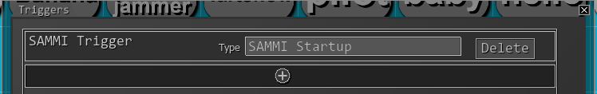
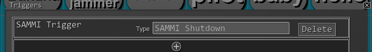

# Voicemod-Sammi connector

_I swear I've put a little bit more effort in this one_

This is Voicemod-Sammi connector! Through http endpoints, you can change your voice effect much quicker and with no conflicts with your keyboard, which means you can create a http request button through SAMMI and on pressing it, you will change your voice! Also giving the ability for your chat to change your voice on demand. Pretty cool, right?

## Requirements

- Voicemod
  - A developer key is needed
- SAMMI Stream Deck
- NodeJS 18.16.0
- Yarn 1.22.19 (globally installed)

### Creating a environment file

In the root of the project, create a file `.env.production` and fill in the variables:

```
PORT=3000
computerIP=localhost
APIKey=your voicemod apikey here
```

## How to use

You can manually start the project through your terminal with `yarn start`, but you could also start it alongside your SAMMI stream deck. Just create a button that would execute the following command:

```cmd
yarn --cwd C:\where\the\project\is start
```

And add the following trigger:



Just don't forget to also add a button that would close the project on SAMMI shutdown. Use the command:

```cmd
taskkill /IM "node.exe" /F
```



### Endpoints

The following endpoints are available to use. If you have set `computerIP` to `localhost` and `PORT` to `3000`, your HTTP prefix should be `http://localhost:3000/voicemod`. If you prefer to use this application in a server, you likely would have to change at least `computerIP`.

| endpoint                       | method | body                              | params                                                              | description                                                                                            |
| ------------------------------ | ------ | --------------------------------- | ------------------------------------------------------------------- | ------------------------------------------------------------------------------------------------------ |
| /getCurrentVoice/:sammiTrigger | GET    |                                   | sammiTrigger: The webhook trigger you have set in your SAMMI button | Gets the current voice you're using                                                                    |
| /setVoice                      | POST   | <br>{<br>voiceID: string<br>}<br> |                                                                     | Sets a voice with a valid `voiceID`. Tip: use getCurrentVoice to figure voiceIDs you would like to use |
| /toggleHearMyself              | POST   |                                   |                                                                     | Toggle hear myself functionality in Voicemod                                                           |
| /censor                        | POST   | {<br>state: number<br>}           |                                                                     | Set the `state` of the censor beep. State needs to be either 0 or 1.                                   |

## Words from the author

This project was written to solve a particular problem of mine. SAMMI is not able to send keystrokes to Voicemod, whenever I have a game open, so sending commands through it's official websocket implementation solved the issue and now my chat can change my voice on command. Even tho with SAMMI in mind, it's likely that you can use it in other scenarios, given that this project is based on http protocol.

Make good use of it!
